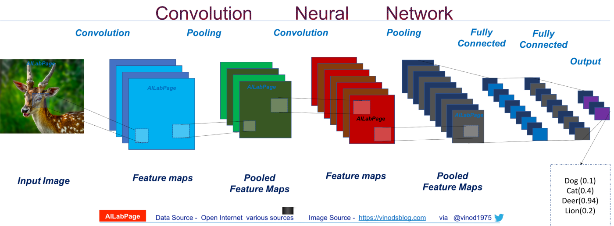
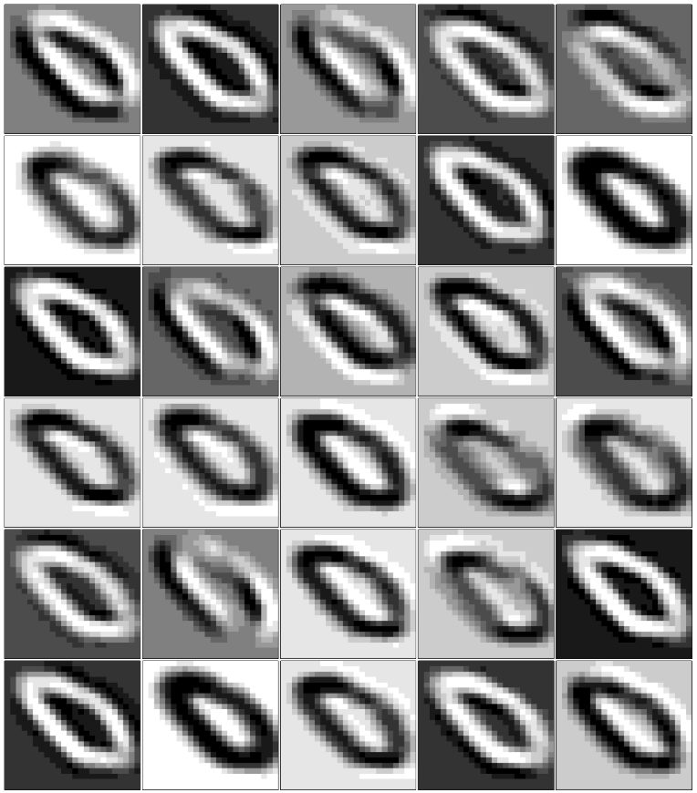
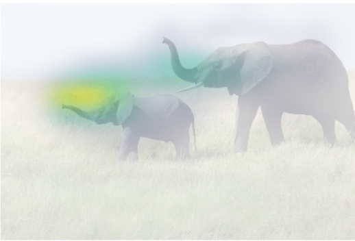

## CNN

### What is CNN?

* CNN(Convolution Neural Network)
* a class of deep neural networks, most commonly applied to analyzing visual imagery
* uses relatively little pre-processing compared to other image classification algorithms
    + the network learns to extract important features using filters
    + the number of parameters are lowered efficiently by the use of **convolution layer** and **pooling layer**, leading to reduced model complexity
* Design
    + A convolutional neural network consists of an **input** and an **output layer**, as well as multiple **hidden layers**. The hidden layers of a CNN typically consist of **convolutional layers**, **RELU layer** i.e. activation function, **pooling layers**, **fully connected layers** and **normalization layers**
        + Convolutional
        + Pooling
        + Fully connected
        + Weights

#### [Return activations of nodes in CNN](https://github.com/apache/incubator-mxnet/issues/1152)

  

* returns the activations of hidden nodes in CNN, using MNIST image
* trains a model with 2 convolution layers and visualizes the result of the 2 layers

#### [CAM : Class Acitivation Map]

* VGG16
    + VGG16 is a convolutional neural network model proposed by K. Simonyan and A. Zisserman from the University of Oxford in the paper “Very Deep Convolutional Networks for Large-Scale Image Recognition”. The model achieves 92.7% top-5 test accuracy in ImageNet, which is a dataset of over 14 million images belonging to 1000 classes. 

* CAM(Class Activation Map)
    + displays a heatmap on the image to show which part of the image was activated when classifying the image into a particular class
        

          
        

